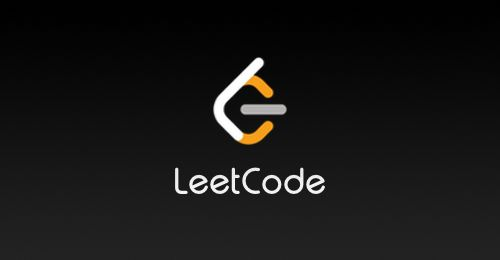

# LeetCode
LeetCode Solutions Summary

>   From 2019-09-21 22:21 to the present

---

## Introduction

LeetCode solutions, including different solutions to the same problem, data structure and algorithm analysis.

[Solutions](./problems)

[Source Code](./code)

## About me

An undergraduate && Grtaduate student at the University of Minnesota, majoring in *Computer Science*, and *Mathematics*.

Currently I have to give up my lovely machematics, and I'll pick it up after I get a job offer.

My personal website is: https://aden-q.github.io/.

 I usaually share some notes on my website (maybe will share my personal life in the future).

## Issue

Please contact me for any issue via email:

<a href="mailto:qian0102@umn.edu">qian0102@umn.edu 

</a>

## License

[MIT](./LICENSE)